  
  
  

<table>
  <tr>
    <td width="62%" valign="top">
      <h3>Hello</h3>
      
Halo, saya Sayyidina—full-stack developer yang suka mengubah alur rumit menjadi produk web yang terasa ringan.

      
Saya paling betah saat merapikan interface, memangkas friction, dan menjaga codebase tetap masuk akal ketika fitur bertambah.

    </td>
    <td width="38%" valign="top">
      <h3>Now playing</h3>
      

        <code>BUILD</code>&nbsp;&nbsp; fast, clear web products  
        <code>REFINE</code>&nbsp; UI details &amp; durable systems  
        <code>EXPLORE</code> practical AI
      

    </td>
  </tr>
</table>

## 01 · Build playground

<table>
  <tr>
    <td width="50%" valign="top">
      <h3>▰ Dashboards</h3>
      
Data mudah dibaca, hierarki kuat, dan action yang jelas.

      
<code>dense</code> <code>calm</code> <code>useful</code>

    </td>
    <td width="50%" valign="top">
      <h3>◆ Web apps</h3>
      
Flow cepat, loading ringan, dan state yang tidak membingungkan.

      
<code>modern</code> <code>clean</code> <code>responsive</code>

    </td>
  </tr>
  <tr>
    <td colspan="2" valign="top">
      <h3>✦ UI experiments</h3>
      
Motion yang terasa hidup, tetapi tetap punya fungsi.

      
<code>sharp</code> <code>expressive</code> <code>intentional</code>

    </td>
  </tr>
</table>

## 02 · Toolbox

  <strong>CRAFT</strong>  
  

  <strong>BUILD &amp; SHIP</strong>  
  

## 03 · Next map: AI

<table>
  <tr>
    <td width="25%" align="center" valign="middle">
      
        
      <code>learning in progress</code>
    </td>
    <td width="75%" valign="top">
      
Saya ingin mendalami AI dari fondasinya: memahami cara model bekerja, mengintegrasikannya ke aplikasi, lalu menguji apakah hasilnya benar-benar membantu pengguna.

      
Bukan AI di setiap fitur—hanya saat ia memang memberi nilai.

    </td>
  </tr>
</table>

  
  
  

## 04 · Commit arcade

  <em>Pac-Man eats the dots. I keep feeding the board.</em>

<picture>
  <source
    media="(prefers-color-scheme: dark)"
    srcset="https://raw.githubusercontent.com/RexCrowSS1/RexCrowSS1/output/pacman-contribution-graph-dark.svg"
  >
  <source
    media="(prefers-color-scheme: light)"
    srcset="https://raw.githubusercontent.com/RexCrowSS1/RexCrowSS1/output/pacman-contribution-graph.svg"
  >
  
</picture>

  Contribution data diperbarui otomatis setiap enam jam.

  
<strong>Open player stats</strong>

   
  

    
    
  

## 05 · Build loop

  
  
  
  

  Understand the problem. Remove the noise. Build the useful part. 
  Polish what people actually touch.

---

<h3 align="center">Have an interesting web idea?</h3>

  Punya ide yang perlu dibuat lebih jelas, cepat, atau menyenangkan dipakai? Mari ngobrol.

  <a href="mailto:sayyidinaanshari@gmail.com">Email</a>
  &nbsp; · &nbsp;
  <a href="https://github.com/RexCrowSS1">GitHub</a>
  &nbsp; · &nbsp;
  <a href="https://sayyidina.vercel.app">Portfolio</a>

  

